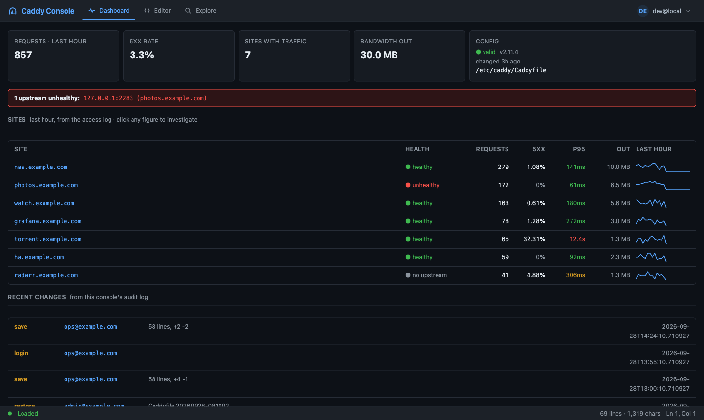
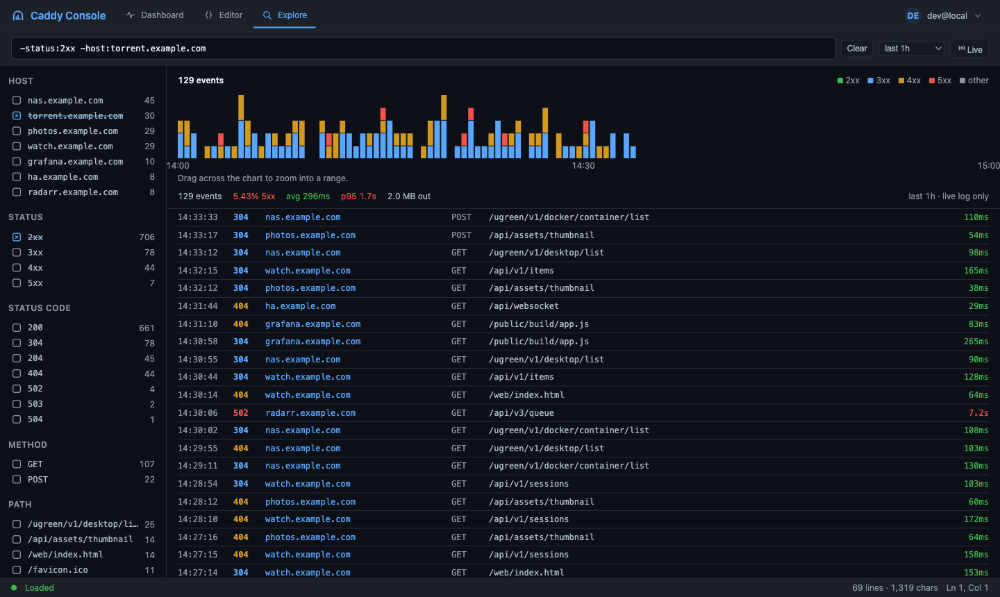
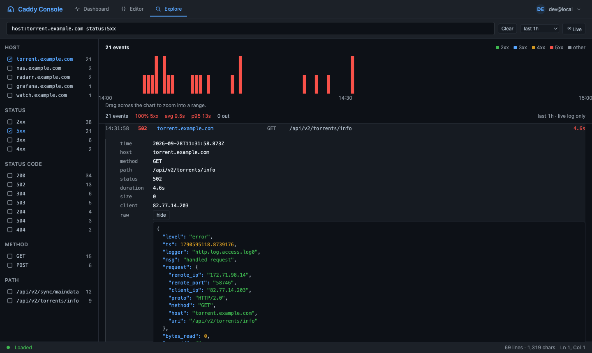
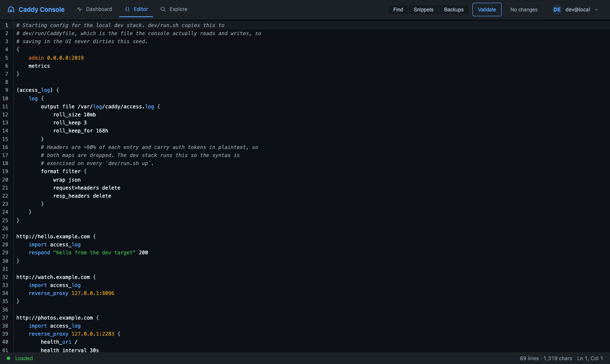

# Caddy Console

A console for a self-hosted Caddy: edit the Caddyfile, save and reload with no
downtime, and see what your sites are actually doing — read from Caddy's own access
log, with no database and nothing to keep in sync.

Three views, each with its own URL.

## Dashboard — is anything broken?

One row per site: upstream health, requests, 5xx rate, p95 latency, bandwidth and
an hourly sparkline. **Every figure is a link** into the explorer with that filter
already applied, so "torrent is at 21% errors" is one click from the requests that
caused it.



## Explore — why is it broken?

Faceted search over the access log. Type `host:… status:5xx path:/api`, or plain
text, or prefix a term with `-` to exclude it — `-status:2xx` is everything that
did not go well. Sidebar rows cycle through the same three states as you click
them: off, only this (☑), everything but this (☒). Counts update with your filters,
and a count always equals what clicking it returns. Drag the histogram to zoom
into a spike.



The whole view lives in the URL — filters, range, absolute timestamps — so a link
reproduces exactly what you were looking at. Ranges run from 30 minutes to 30 days;
older ranges are served by reading Caddy's rolled `.gz` archives, so how far back
you can look is simply how much `roll_keep` has kept.

Expand an event for its fields, each with a menu to filter, exclude or copy — plus
the original log line, formatted.



## Editor — fix it

CodeMirror 6 with Caddyfile syntax highlighting, find and replace, and `Cmd+S` to
save. **Validate** formats and checks the config without saving; **Save & Reload**
writes the file and reloads Caddy through its admin API. Every save takes a backup
first, with an inline diff and one-click restore.



## Quick start

```bash
git clone https://github.com/ViralOne/caddy-console.git
cd caddy-console
cp .env.example .env          # set AUTH_MODE, SECRET_KEY, ALLOWED_EMAILS
docker compose -f docker-compose.prod.yaml up -d
```

Two things to do next, both in [docs/setup.md](docs/setup.md):

1. **Pick an auth mode** — Google OAuth, or Cloudflare Access in front of it.
2. **Turn on access logging** with `format filter`, so the dashboard and explorer
   have data — and so your logs do not contain plaintext session tokens.

## Docs

| | |
|---|---|
| [Setup](docs/setup.md) | Deploying it, auth modes, access logging, retention, environment variables, API reference |
| [Development](docs/development.md) | Local no-auth stack, seeding log data, tests, front-end build |
| [Architecture](docs/architecture.md) | Why there is no database, how the log is indexed, why Preact for two views |

## Also in here

- **Backups** — taken before every save, with preview, inline diff and restore
- **Audit log** — who changed what, surfaced on the dashboard
- **Snippets** — common Caddyfile patterns to insert
- **Upstream health** — from Caddy's active health checks

## Requirements

Docker, and a Caddy instance with its admin API reachable (`admin 0.0.0.0:2019` in
the global block). Nothing else: app code ships as plain ES modules, so there is no
build step and a clone needs no npm.
